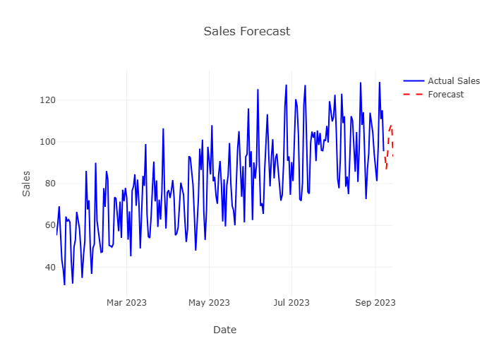

# 📊 Retail Sales Forecasting & Inventory Optimization System

## 🚀 Overview

This project predicts future retail sales using machine learning and optimizes inventory using safety stock and reorder point logic.

## 💡 Features

* 📈 Sales Forecasting (Machine Learning)
* 📊 Interactive Dashboard (Streamlit + Plotly)
* 📦 Inventory Optimization (Safety Stock, Reorder Point)
* 🔄 Realistic Data Simulation (Trend + Seasonality)

## 🛠 Tech Stack

* Python
* Pandas, NumPy
* Scikit-learn
* Streamlit
* Plotly

## 📊 Output

* Sales Forecast Graph
* Future Demand Prediction
* Inventory Recommendation

## ▶️ Run Project

```bash
streamlit run app/app.py
```

## 📸 Screenshots

(Add images here)


## 📸 Screenshots

### 📊 Dashboard


### 📈 Forecast Graph




## 👨‍💻 Author

Bablu kumar
